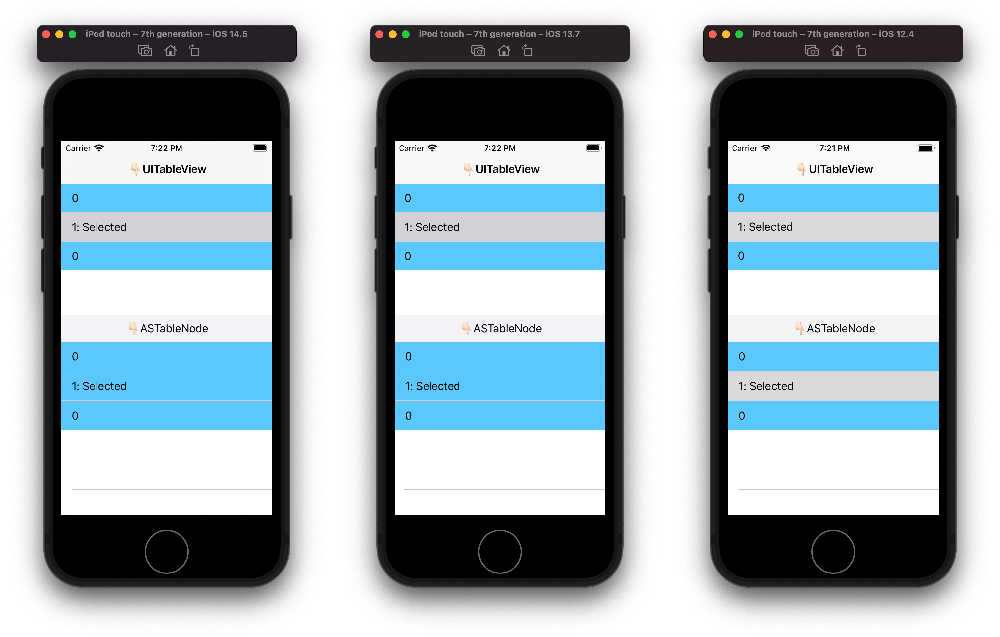
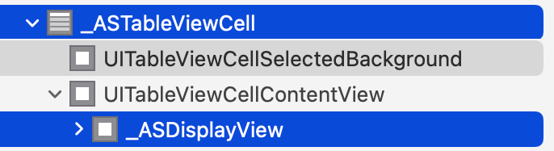
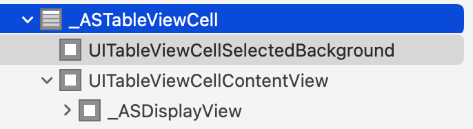
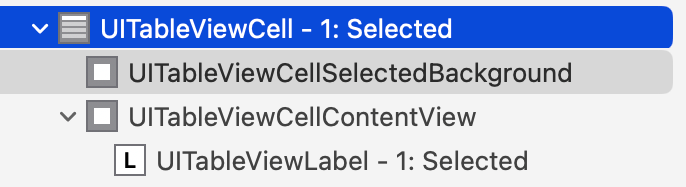

Here's the demo project of Texture issue:

Cell selection not visible after setting ASCellNode backgroundColor on iOS 13 or later.

When setting backgroundColor of ASCellNode, Texture has been setting backgroundColor on both `_ASDisplayView` (added on top of contentView) and underlying `_ASTableViewCell`.

This bug happens on iOS 13 or later, which may result from UIKit behavior change.

Prior to iOS 13, UIKit would make `_ASDisplayView` transparent when cell is selected. This behavior no longer works on iOS 13 or later, which results in **opaque `_ASDisplayView` blocking selection color below (`UITableViewCellSelectedBackground`)**.

I would suggest solutions that make Texture behave similar to UIKit:

