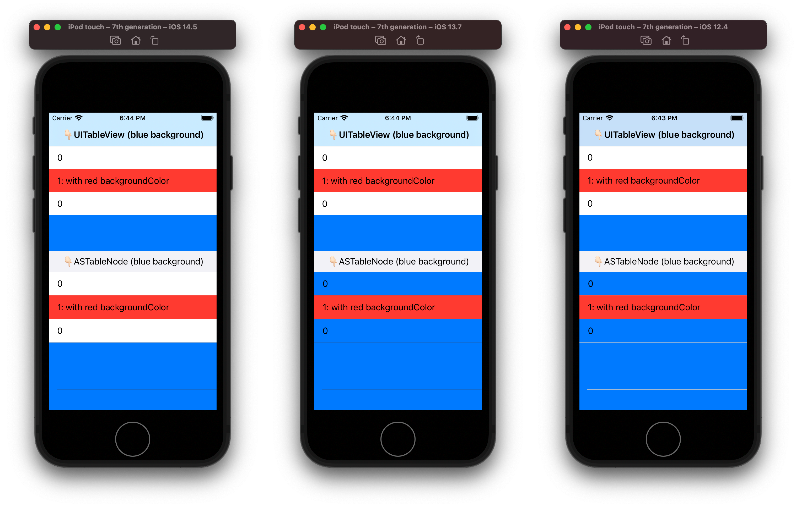

Here's the demo project of [Texture issue #2009](https://github.com/TextureGroup/Texture/issues/2009#issuecomment-877094879) based on my understanding:

On iOS 14 or later, background color of table view cell will no longer be transparent when `cell.backgroundColor` is not set.
